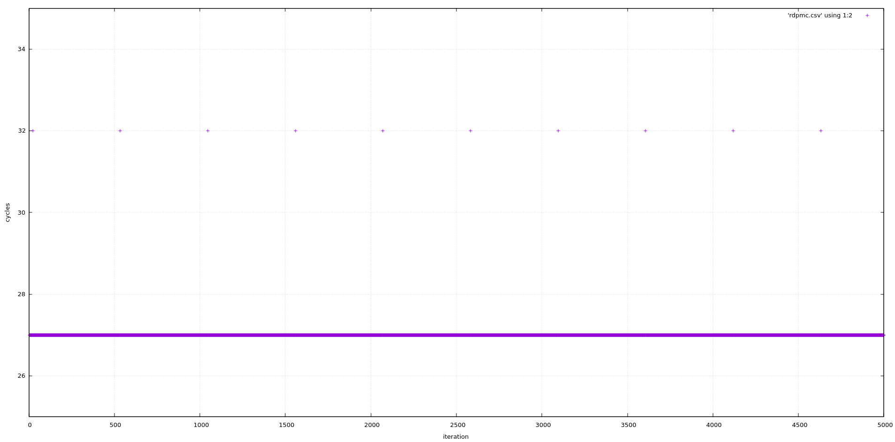
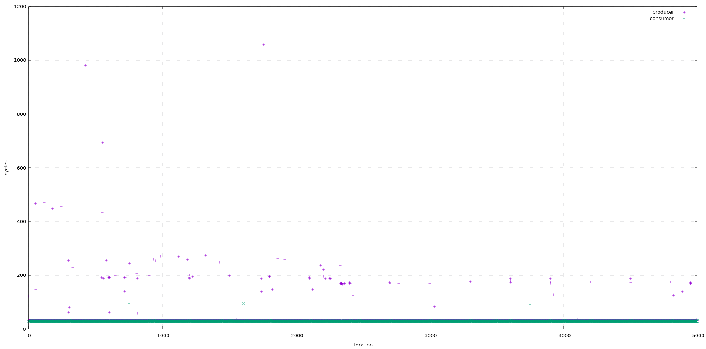
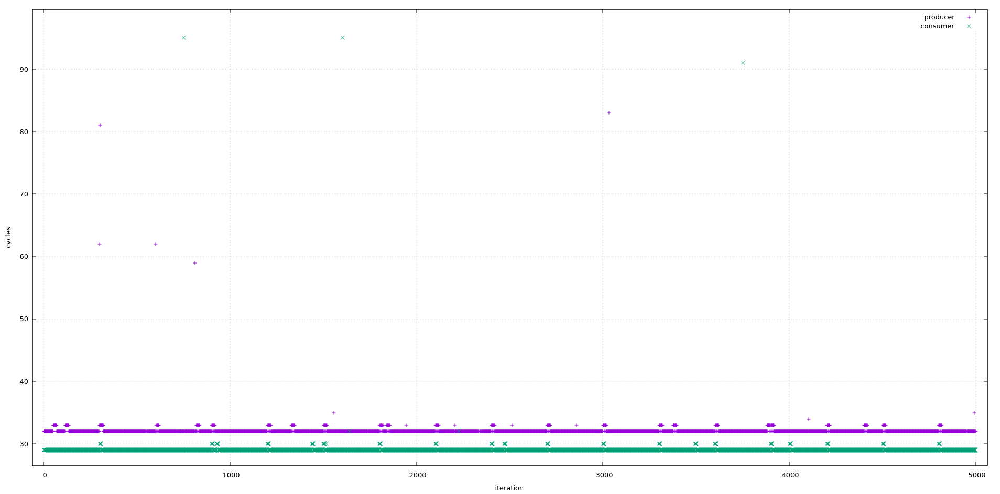
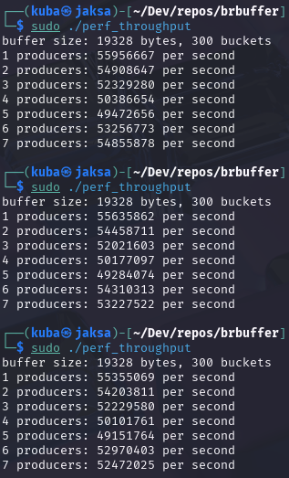
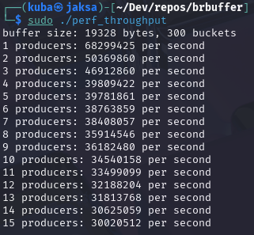

# Lockless bucket ring buffer (MPSC)
Lock free ring buffer that stores data in buckets of constant size. It supports multiple producers but only one consumer. Suitable for use when data stored in the buffer does not vary much in size. Written in C++17 standard.
## Usage
- `BRingBuffer<capacity, maxDataSize> buffer;`
  
  creates a buffer with a number `capacity` of buckets and each bucket can contain data of `maxDataSize` size.
- `void* reserve(const std::uint32_t dataSize)`

  reserves data in buffer, returns pointer to the appropriate bucket where user data can be stored. Returns `nullptr` if buffer is full.
- `void commit(void* const dataPtr)`

  commits previously reserved data, after this call data is ready to be read by the consumer.
- `void* peek(std::uint32_t& dataSize, const std::uint64_t magicId)`

  checks if there is data ready to consume, returns `nullptr` if the buffer is empty. The size of the data is put into `dataSize` for the user. `magicId` should be initially set to `0` by the caller and must not be changed by the caller in the future. This allowed to remove one atomic load operation.
- `void decommit(void* const dataPtr, std::uint64_t& magicId)`

  marks the bucket to be available to the producers. `magicId` is changed internally and should be passed to the next `peek()` call.
## The algorithm
1. The producers cannot exceed the consumer.
2. The consumer advances from one bucket to the next and checks if data is available. Data is consumed sequentially.
3. Both the producers and consumer keep the track of wrap around count to prevent producers from exceeding the consumer.

For the most optimistic case there are two atomic loads, one CAS operation and one atomic store for a producer.

There is always one atomic load and two atomic stores for the consumer.
## Tests
Added stability test that checks the integrity of the data put into buffer and two performance tests, one for throughput and one for CPU cycles. For performance tests p-states, c-states and SMT were disabled. I tested it on my laptop with AMD Ryzen™ 7 7735U.

Consecutive calls to rdpmc() are very stable and take 27 cycles:

For 1 producer 1 consumer scenario:

The throughput on my machine is around 55 milions per second:
 

Throughput is higher for 1 producer 1 consumer case with SMT ON where they run on the same physical core:

